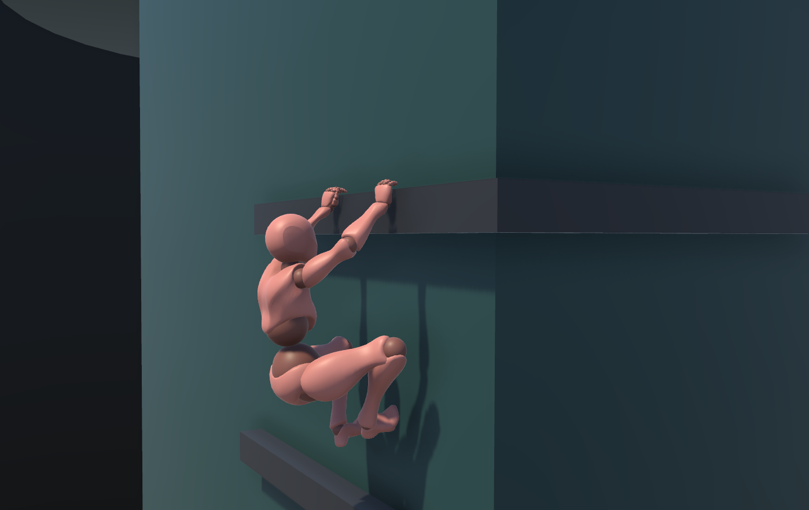
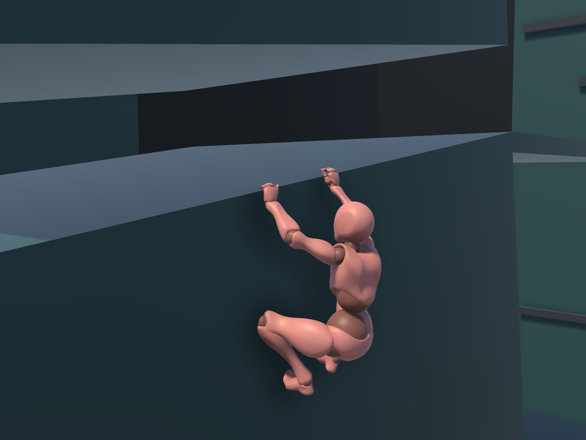
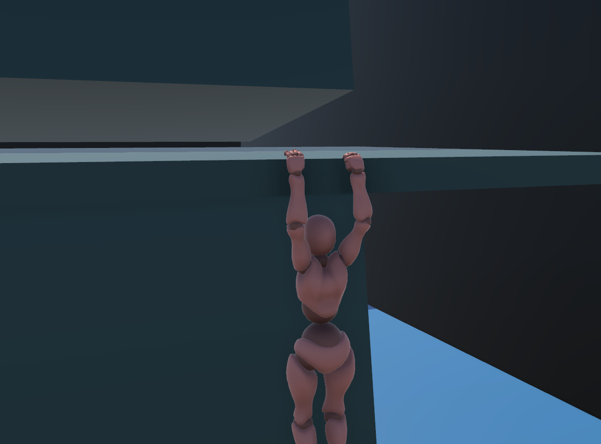
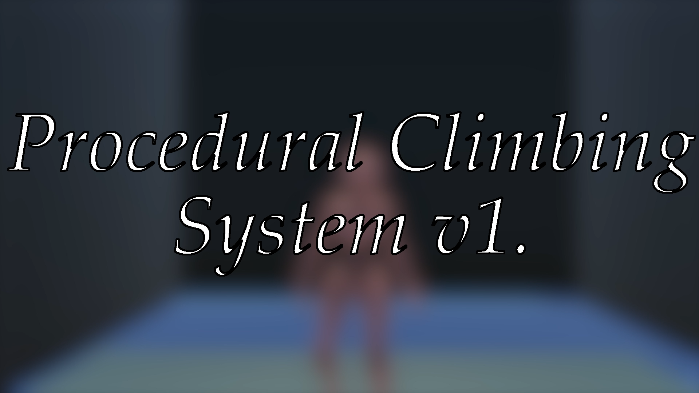

# Procedural-Climbing-System

A procedural climbing system implementation. The project contains the following features;

* Basic Movement System
* Stepping and Vaulting System
* Ledge Detection System
* Climbing in Move Direction
* Climbing at Sloppy Ledges
* Inverse Kinemtatics for Hands and Feet

# Images

# Game Play Video

